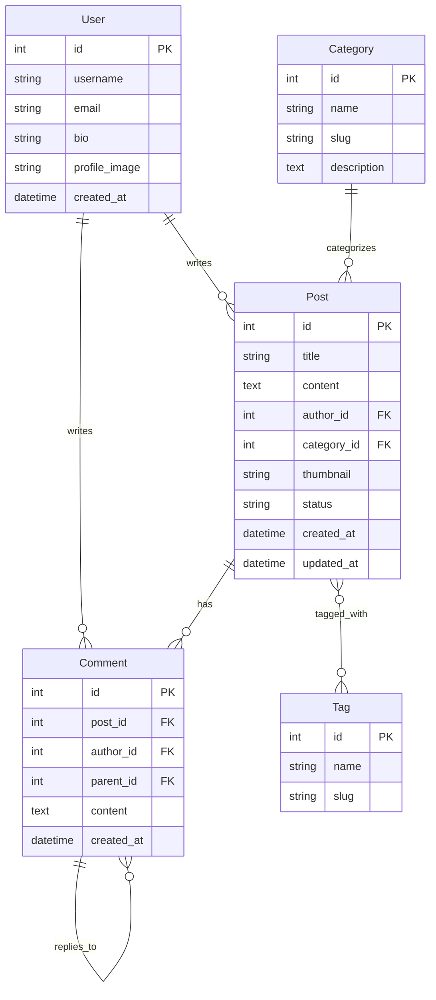

# GEMINI.md 작성 가이드

## 학습 목표

gemini-cli에서 사용하는 GEMINI.md 파일의 구조와 작성 방법을 이해하고, Django 프로젝트에 적용할 수 있는 실무 중심의 컨텍스트 파일을 직접 작성할 수 있다.

## 사전 준비

- gemini-cli 설치 및 기본 사용법 숙지
- Django 프로젝트 구조에 대한 기본 이해
- 마크다운 문법 기초 지식

---

## 전체 흐름 한눈에 보기

GEMINI.md는 AI 모델(Gemini)이 프로젝트를 이해하고 작업할 때 참고하는 "프로젝트 설명서"이다. 이 파일은 프로젝트 루트에 위치하며, Rule(규칙)과 Context(맥락) 두 가지 핵심 섹션으로 구성된다.

**주요 단계:**
1. GEMINI.md의 역할과 필요성 이해
2. Rule 섹션 작성 - AI가 따라야 할 행동 규칙
3. Context 섹션 작성 - 프로젝트 배경 및 기술 정보
4. Django 프로젝트 예시로 실전 적용
5. gemini-cli 명령어로 빠른 생성 및 검증

---

## Phase 1: GEMINI.md 이해하기

### 목표
GEMINI.md가 무엇인지, 왜 필요한지 명확히 이해한다.

### 단계별 구현

#### Step 1.1 — GEMINI.md의 역할 파악하기

GEMINI.md는 프로젝트의 "취업 규칙서"이자 "백과사전"이다. AI 모델이 코드를 생성하거나 수정할 때:
- **어떤 스타일로** 코드를 작성해야 하는지 (Rule)
- **어떤 맥락에서** 프로젝트가 동작하는지 (Context)

이 두 가지를 미리 알려주는 역할을 한다.

> **💡 개념 설명: 왜 GEMINI.md가 필요한가?**
> 
> AI 모델은 대화마다 매번 초기화된다. 프로젝트 규칙을 매번 설명하는 대신, GEMINI.md에 한 번 작성해두면:
> - **일관성**: 모든 대화에서 동일한 코딩 스타일 유지
> - **효율성**: 매번 "우리 프로젝트는 DRF 사용해"라고 말할 필요 없음
> - **정확성**: 프로젝트 구조를 미리 알려줘서 잘못된 경로나 파일명 생성 방지
> 
> **한 줄 요약**: GEMINI.md는 AI의 작업 지침서다.

#### Step 1.2 — 기본 파일 위치 확인

GEMINI.md는 반드시 **프로젝트 루트 디렉토리**에 위치해야 한다.

```bash
# 파일 위치 예시

my-django-project/
├── GEMINI.md          ← 여기!
├── manage.py
├── requirements.txt
├── myapp/
│   ├── models.py
│   └── views.py
└── config/
    └── settings.py
```

### 체크포인트

- [ ] GEMINI.md의 두 가지 핵심 섹션(Rule, Context)을 설명할 수 있다
- [ ] 프로젝트 루트에 GEMINI.md 파일을 생성할 위치를 알고 있다

---

## Phase 2: Rule 섹션 작성하기

### 목표
AI가 코드를 생성할 때 따라야 할 행동 규칙을 명확히 정의한다.

### 단계별 구현

#### Step 2.1 — Rule 섹션 구조 이해하기

Rule 섹션은 "명령형 문장"으로 작성한다. AI에게 "이렇게 해라"라고 지시하는 방식이다.

> **💡 개념 설명: Rule vs Context**
> 
> - **Rule**: "어떻게 행동할 것인가" (행동 지침)
>   - 예: "함수는 반드시 docstring을 포함해라"
> - **Context**: "무엇을 알아야 하는가" (배경 지식)
>   - 예: "이 프로젝트는 Django 4.2를 사용한다"
> 
> Rule은 **명령**, Context는 **설명**이다.

#### Step 2.2 — Django 프로젝트 Rule 예시 작성

```markdown
# GEMINI.md

## Rule

### 코드 스타일
- 모든 Python 코드는 PEP 8 스타일 가이드를 따른다
- 함수와 클래스에는 반드시 docstring을 작성한다
- 들여쓰기는 공백 4칸을 사용한다

### Django 규칙
- 새로운 앱을 생성할 때는 `python manage.py startapp` 명령을 사용한다
- URL 패턴은 반드시 앱별로 `urls.py`를 분리하고 `include()`로 연결한다
- settings.py는 환경별로 분리한다 (dev, prod)

### 데이터베이스
- 모델 변경 후에는 반드시 `makemigrations`와 `migrate`를 실행한다
- 외래 키는 `on_delete` 옵션을 명시적으로 지정한다
- 테이블명은 소문자와 언더스코어를 사용한다 (예: `user_profile`)

### API 설계
- Django REST Framework를 사용하여 RESTful API를 구현한다
- 모든 API 응답은 다음 형식을 따른다:
  ```json
  {
    "success": true,
    "data": {},
    "message": "설명"
  }
  ```
- 인증은 JWT 토큰 방식을 사용한다

### 에러 처리
- try-except 블록에서는 구체적인 예외를 명시한다 (bare except 금지)
- 커스텀 예외 클래스는 `myapp/exceptions.py`에 정의한다
- 에러 로그는 반드시 logger를 사용한다 (print 금지)

### 테스트
- 모든 뷰와 모델에 대한 유닛 테스트를 작성한다
- 테스트 파일명은 `test_*.py` 형식을 따른다
- 테스트 실행: `python manage.py test`

### 문서화
- README.md에 프로젝트 설정 방법을 명시한다
- API 엔드포인트는 주석으로 설명한다
- 환경 변수는 `.env.example` 파일에 예시를 제공한다
```

> **💡 개념 설명: Rule 작성 팁**
> 
> 좋은 Rule은:
> 1. **구체적**: "코드를 깔끔하게 작성해라" ❌ → "함수는 최대 50줄을 넘지 않는다" ✅
> 2. **실행 가능**: AI가 바로 적용할 수 있는 명령
> 3. **카테고리별 분류**: 코드 스타일, DB 규칙, API 규칙 등으로 구분
> 
> **한 줄 요약**: Rule은 "~해라" 형식의 명확한 명령문이다.

#### Step 2.3 — 팀 컨벤션 반영하기

실제 프로젝트에서는 팀의 코딩 컨벤션을 Rule에 추가한다.

```markdown
### 네이밍 규칙
- 변수명: snake_case (예: `user_name`)
- 클래스명: PascalCase (예: `UserProfile`)
- 상수명: UPPER_SNAKE_CASE (예: `MAX_LENGTH`)
- URL 이름: kebab-case (예: `user-detail`)

### Git 커밋 규칙
- 커밋 메시지는 다음 형식을 따른다: `[타입] 제목`
- 타입: feat, fix, docs, style, refactor, test, chore
- 예시: `[feat] 사용자 로그인 API 추가`
```

### 체크포인트

- [ ] Rule 섹션에 최소 5개 이상의 카테고리(코드 스타일, Django 규칙 등)를 작성했다
- [ ] 각 규칙이 "명령형 문장"으로 작성되었는지 확인했다
- [ ] 프로젝트 특성에 맞는 팀 컨벤션을 추가했다

---

## Phase 3: Context 섹션 작성하기

### 목표
프로젝트의 기술 스택, 아키텍처, 주요 기능을 설명하여 AI가 프로젝트를 이해하도록 돕는다.

### 단계별 구현

#### Step 3.1 — Context 섹션 구조 이해하기

Context는 "설명형 문장"으로 작성한다. 프로젝트가 "무엇인지", "어떤 기술을 사용하는지" 알려준다.

```markdown
## Context

### 프로젝트 개요
이 프로젝트는 온라인 도서 관리 시스템이다. 사용자는 책을 검색하고, 대출하고, 반납할 수 있다.

### 기술 스택
- **백엔드**: Django 4.2, Django REST Framework 3.14
- **데이터베이스**: PostgreSQL 15
- **인증**: Django SimpleJWT
- **배포**: Docker, Gunicorn, Nginx
- **버전 관리**: Git, GitHub
```

> **💡 개념 설명: 왜 기술 스택을 명시하는가?**
> 
> AI는 "Django"라고만 하면 어느 버전인지, 어떤 확장 패키지를 쓰는지 모른다. 구체적인 버전을 명시하면:
> - 해당 버전의 문법과 기능을 사용
> - Deprecated된 기능 사용 방지
> - 호환성 문제 사전 차단
> 
> **한 줄 요약**: 버전까지 명시해야 정확한 코드가 생성된다.

#### Step 3.2 — 디렉토리 구조 설명하기

```markdown
### 디렉토리 구조
```
myproject/
├── config/              # Django 설정 파일
│   ├── settings/
│   │   ├── base.py     # 공통 설정
│   │   ├── dev.py      # 개발 환경
│   │   └── prod.py     # 운영 환경
│   ├── urls.py         # 루트 URL 설정
│   └── wsgi.py
├── books/              # 도서 관리 앱
│   ├── models.py       # Book, Author 모델
│   ├── views.py        # API 뷰
│   ├── serializers.py  # DRF 직렬화
│   └── urls.py
├── users/              # 사용자 관리 앱
│   ├── models.py       # CustomUser 모델
│   ├── views.py
│   └── urls.py
├── core/               # 공통 유틸리티
│   ├── exceptions.py   # 커스텀 예외
│   └── utils.py        # 헬퍼 함수
├── manage.py
├── requirements.txt
└── GEMINI.md
```
```

#### Step 3.3 — 핵심 모델 설명하기

```markdown
### 주요 모델

#### Book 모델
- 필드: title, author (FK), isbn, published_date, available_count
- 관계: Author(1) - Book(N)
- 기능: 도서 정보 저장 및 대출 가능 여부 관리

#### User 모델
- Django의 AbstractUser를 상속
- 추가 필드: phone_number, address
- 기능: 사용자 인증 및 대출 이력 관리

#### Loan 모델
- 필드: user (FK), book (FK), loan_date, return_date, is_returned
- 관계: User(1) - Loan(N), Book(1) - Loan(N)
- 기능: 도서 대출/반납 이력 추적
```

#### Step 3.4 — API 엔드포인트 정리하기

```markdown
### API 엔드포인트

#### 인증
- `POST /api/auth/register/` - 회원가입
- `POST /api/auth/login/` - 로그인 (JWT 발급)
- `POST /api/auth/refresh/` - 토큰 갱신

#### 도서
- `GET /api/books/` - 도서 목록 조회 (검색, 필터링)
- `GET /api/books/{id}/` - 도서 상세 조회
- `POST /api/books/` - 도서 등록 (관리자만)
- `PUT /api/books/{id}/` - 도서 수정 (관리자만)

#### 대출
- `POST /api/loans/` - 도서 대출
- `GET /api/loans/my/` - 내 대출 이력
- `POST /api/loans/{id}/return/` - 도서 반납
```

#### Step 3.5 — 환경 변수 및 설정 안내

```markdown
### 환경 변수
프로젝트는 `.env` 파일을 사용한다:

```bash
# .env.example

# Django
SECRET_KEY=your-secret-key
DEBUG=True
ALLOWED_HOSTS=localhost,127.0.0.1

# Database
DB_NAME=bookstore
DB_USER=postgres
DB_PASSWORD=password
DB_HOST=localhost
DB_PORT=5432

# JWT
JWT_SECRET_KEY=your-jwt-secret
JWT_ALGORITHM=HS256
```

### 로컬 개발 환경 설정
1. 가상환경 생성: `python -m venv venv`
2. 패키지 설치: `pip install -r requirements.txt`
3. 환경 변수 설정: `.env` 파일 생성
4. 데이터베이스 마이그레이션: `python manage.py migrate`
5. 개발 서버 실행: `python manage.py runserver`
```

### 체크포인트

- [ ] 프로젝트 개요, 기술 스택, 디렉토리 구조를 작성했다
- [ ] 주요 모델과 관계를 설명했다
- [ ] API 엔드포인트 목록을 정리했다
- [ ] 환경 변수와 로컬 설정 방법을 명시했다

---

## Phase 4: gemini-cli로 빠르게 생성하기

### 목표
gemini-cli의 명령어를 활용하여 GEMINI.md를 자동 생성하고 수정하는 방법을 익힌다.

### 단계별 구현

#### Step 4.1 — 초기 GEMINI.md 자동 생성

gemini-cli는 프로젝트를 분석하여 기본 GEMINI.md를 생성할 수 있다.

```bash
# 프로젝트 루트에서 실행

gemini init
```

> **💡 개념 설명: gemini init의 동작 원리**
> 
> `gemini init` 명령은:
> 1. 프로젝트의 파일 구조를 스캔
> 2. `requirements.txt`, `package.json` 등에서 기술 스택 추출
> 3. 주요 파일(models.py, views.py 등)을 분석
> 4. 기본 템플릿 기반으로 GEMINI.md 생성
> 
> 완벽하진 않지만, 80% 정도의 초안을 자동으로 만들어준다.
> 
> **한 줄 요약**: `gemini init`은 프로젝트 분석 후 자동 초안 생성 명령이다.

#### Step 4.2 — 대화형으로 Context 추가하기

생성된 GEMINI.md를 더 풍부하게 만들려면:

```bash
# AI와 대화하며 Context 보강

gemini chat

> "이 프로젝트의 주요 기능을 GEMINI.md의 Context에 추가해줘"
> "API 엔드포인트 목록을 정리해서 GEMINI.md에 넣어줘"
> "데이터베이스 ERD를 Mermaid 다이어그램으로 추가해줘"
```

#### Step 4.3 — 특정 섹션 업데이트하기

프로젝트가 변경될 때마다 GEMINI.md도 업데이트해야 한다.

```bash
# 새로운 앱 추가 후

gemini update context --section "디렉토리 구조"
```

또는 직접 파일을 수정:

```bash
# GEMINI.md 열기
code GEMINI.md

# 또는
vim GEMINI.md
```

#### Step 4.4 — GEMINI.md 검증하기

작성한 GEMINI.md가 제대로 동작하는지 테스트:

```bash
# gemini-cli가 GEMINI.md를 올바르게 읽는지 확인

gemini validate

# 출력 예시:
# ✅ GEMINI.md 파일 발견
# ✅ Rule 섹션 파싱 성공 (7개 규칙)
# ✅ Context 섹션 파싱 성공
# ⚠️  경고: '배포' 섹션이 비어있습니다
```

> **💡 개념 설명: GEMINI.md 검증의 중요성**
> 
> GEMINI.md에 오타나 잘못된 형식이 있으면:
> - AI가 규칙을 무시할 수 있음
> - Context를 잘못 해석할 수 있음
> 
> `gemini validate`로 정기적으로 검증하여 문제를 조기 발견해야 한다.
> 
> **한 줄 요약**: validate로 GEMINI.md의 유효성을 검증한다.

### 체크포인트

- [ ] `gemini init`으로 초기 GEMINI.md를 생성했다
- [ ] `gemini chat`으로 Context를 보강했다
- [ ] `gemini validate`로 파일을 검증했다

---

## Phase 5: 실전 예시 - Django 블로그 프로젝트

### 목표
실제 Django 블로그 프로젝트에 대한 완전한 GEMINI.md 예시를 보고, 자신의 프로젝트에 적용할 수 있다.

### 완성된 GEMINI.md 예시

```markdown
# GEMINI.md

## Rule

### 코드 스타일
- 모든 Python 코드는 PEP 8 스타일 가이드를 따른다
- 함수와 클래스에는 반드시 docstring을 작성한다 (Google 스타일)
- import 순서: 표준 라이브러리 > 서드파티 > 로컬 애플리케이션
- 한 줄은 최대 88자로 제한한다 (Black 포매터 사용)

### Django 규칙
- 새로운 앱 생성 시 `python manage.py startapp <앱명>` 사용
- URL 패턴은 앱별로 `urls.py` 분리 후 `include()`로 연결
- settings.py는 환경별로 분리: `settings/base.py`, `settings/dev.py`, `settings/prod.py`
- 모든 뷰는 클래스 기반 뷰(CBV)를 우선 사용
- 템플릿 파일은 `<앱명>/templates/<앱명>/` 구조를 따른다

### 데이터베이스
- 모델 변경 후 `python manage.py makemigrations && python manage.py migrate` 실행
- 외래 키는 `on_delete` 옵션을 명시적으로 지정
- created_at, updated_at 필드는 모든 모델에 포함
- 인덱스가 필요한 필드는 `db_index=True` 설정

### API 설계 (Django REST Framework)
- ViewSet을 사용하여 CRUD API 구현
- Serializer는 `serializers.py`에 정의
- 인증: JWT (djangorestframework-simplejwt)
- 페이지네이션: 기본 20개 항목
- API 응답 형식:
  ```json
  {
    "status": "success",
    "data": {},
    "message": ""
  }
  ```

### 에러 처리
- try-except에서 구체적인 예외 클래스 사용 (Exception 지양)
- 커스텀 예외는 `core/exceptions.py`에 정의
- 로깅은 Python logging 모듈 사용 (print 금지)

### 테스트
- 모든 모델, 뷰, API에 대한 테스트 작성
- 테스트 커버리지 최소 80% 유지
- pytest와 pytest-django 사용
- 테스트 실행: `pytest`

### Git 규칙
- 브랜치 전략: Git Flow (main, develop, feature/*, hotfix/*)
- 커밋 메시지: `[타입] 제목` (예: `[feat] 게시글 작성 API 추가`)
- 타입: feat, fix, docs, style, refactor, test, chore

---

## Context

### 프로젝트 개요
Django 기반의 개인 블로그 플랫폼이다. 사용자는 회원가입 후 게시글을 작성하고, 
다른 사용자의 게시글에 댓글을 달 수 있다. 태그 기반 검색과 카테고리 분류를 지원한다.

### 기술 스택
- **백엔드**: Django 4.2.7, Django REST Framework 3.14.0
- **데이터베이스**: PostgreSQL 15.3
- **인증**: djangorestframework-simplejwt 5.3.0
- **이미지 처리**: Pillow 10.1.0
- **배포**: Docker 24.0, Gunicorn 21.2, Nginx 1.25
- **테스트**: pytest 7.4, pytest-django 4.5
- **버전 관리**: Git, GitHub

### 디렉토리 구조
```
blog_project/
├── config/                 # Django 프로젝트 설정
│   ├── settings/
│   │   ├── base.py        # 공통 설정
│   │   ├── dev.py         # 개발 환경
│   │   └── prod.py        # 운영 환경
│   ├── urls.py            # 루트 URL
│   └── wsgi.py
├── posts/                 # 게시글 관리 앱
│   ├── models.py          # Post, Category 모델
│   ├── views.py           # CBV 뷰
│   ├── serializers.py     # DRF 직렬화
│   ├── urls.py
│   └── tests/
│       ├── test_models.py
│       └── test_views.py
├── comments/              # 댓글 관리 앱
│   ├── models.py          # Comment 모델
│   ├── views.py
│   ├── serializers.py
│   └── urls.py
├── users/                 # 사용자 관리 앱
│   ├── models.py          # CustomUser 모델
│   ├── views.py
│   ├── serializers.py
│   └── urls.py
├── core/                  # 공통 유틸리티
│   ├── exceptions.py      # 커스텀 예외
│   ├── permissions.py     # 커스텀 권한
│   └── utils.py           # 헬퍼 함수
├── media/                 # 업로드 파일
├── static/                # 정적 파일
├── templates/             # 템플릿
├── manage.py
├── requirements.txt
├── pytest.ini
├── .env.example
└── GEMINI.md
```

### 주요 모델

#### CustomUser (users/models.py)
- AbstractUser 상속
- 추가 필드: bio, profile_image, website
- 기능: 사용자 인증, 프로필 관리

#### Post (posts/models.py)
- 필드: title, content, author (FK to User), category (FK), tags (M2M), 
  thumbnail, status (draft/published), created_at, updated_at
- 관계: User(1) - Post(N), Category(1) - Post(N), Tag(N) - Post(M)
- 기능: 게시글 작성, 수정, 삭제, 공개 상태 관리

#### Category (posts/models.py)
- 필드: name, slug, description
- 관계: Category(1) - Post(N)
- 기능: 게시글 분류

#### Tag (posts/models.py)
- 필드: name, slug
- 관계: Tag(N) - Post(M)
- 기능: 게시글 태그 관리

#### Comment (comments/models.py)
- 필드: post (FK), author (FK to User), content, parent (자기참조 FK), 
  created_at, updated_at
- 관계: Post(1) - Comment(N), User(1) - Comment(N)
- 기능: 댓글/대댓글 작성, 계층 구조 지원

### 데이터베이스 ERD



### API 엔드포인트

#### 인증 (users/)
- `POST /api/auth/register/` - 회원가입
- `POST /api/auth/login/` - 로그인 (JWT 발급)
- `POST /api/auth/refresh/` - 토큰 갱신
- `GET /api/auth/me/` - 현재 사용자 정보

#### 게시글 (posts/)
- `GET /api/posts/` - 게시글 목록 (필터: category, tag, status, search)
- `GET /api/posts/{id}/` - 게시글 상세
- `POST /api/posts/` - 게시글 작성 (인증 필요)
- `PUT /api/posts/{id}/` - 게시글 수정 (작성자만)
- `DELETE /api/posts/{id}/` - 게시글 삭제 (작성자만)
- `GET /api/posts/my/` - 내 게시글 목록

#### 댓글 (comments/)
- `GET /api/posts/{post_id}/comments/` - 특정 게시글의 댓글 목록
- `POST /api/posts/{post_id}/comments/` - 댓글 작성
- `PUT /api/comments/{id}/` - 댓글 수정 (작성자만)
- `DELETE /api/comments/{id}/` - 댓글 삭제 (작성자만)

#### 카테고리/태그
- `GET /api/categories/` - 카테고리 목록
- `GET /api/tags/` - 태그 목록

### 환경 변수

```bash
# .env.example

# Django
SECRET_KEY=your-secret-key-here
DEBUG=True
ALLOWED_HOSTS=localhost,127.0.0.1

# Database
DB_NAME=blog_db
DB_USER=postgres
DB_PASSWORD=your-password
DB_HOST=localhost
DB_PORT=5432

# JWT
JWT_SECRET_KEY=your-jwt-secret
JWT_ACCESS_TOKEN_LIFETIME=60  # minutes
JWT_REFRESH_TOKEN_LIFETIME=1440  # minutes (24 hours)

# Media/Static
MEDIA_ROOT=/app/media
STATIC_ROOT=/app/static

# Email (선택)
EMAIL_HOST=smtp.gmail.com
EMAIL_PORT=587
EMAIL_HOST_USER=your-email@gmail.com
EMAIL_HOST_PASSWORD=your-app-password
```

### 로컬 개발 환경 설정

1. **저장소 클론**
   ```bash
   git clone https://github.com/yourname/blog-project.git
   cd blog-project
   ```

2. **가상환경 생성 및 활성화**
   ```bash
   python -m venv venv
   source venv/bin/activate  # Windows: venv\Scripts\activate
   ```

3. **패키지 설치**
   ```bash
   pip install -r requirements.txt
   ```

4. **환경 변수 설정**
   ```bash
   cp .env.example .env
   # .env 파일을 열어 실제 값으로 수정
   ```

5. **데이터베이스 설정**
   ```bash
   # PostgreSQL 데이터베이스 생성
   createdb blog_db
   
   # 마이그레이션 실행
   python manage.py makemigrations
   python manage.py migrate
   ```

6. **슈퍼유저 생성**
   ```bash
   python manage.py createsuperuser
   ```

7. **개발 서버 실행**
   ```bash
   python manage.py runserver
   ```

8. **테스트 실행**
   ```bash
   pytest
   ```

### 주요 기능 구현 예시

#### 게시글 작성 API (posts/views.py 일부)

```python
# posts/views.py

from rest_framework import viewsets, permissions
from rest_framework.decorators import action
from rest_framework.response import Response
from .models import Post
from .serializers import PostSerializer

class PostViewSet(viewsets.ModelViewSet):
    """
    게시글 CRUD API
    """
    queryset = Post.objects.filter(status='published')
    serializer_class = PostSerializer
    permission_classes = [permissions.IsAuthenticatedOrReadOnly]

    def perform_create(self, serializer):
        """게시글 작성 시 현재 사용자를 작성자로 설정"""
        serializer.save(author=self.request.user)

    @action(detail=False, methods=['get'])
    def my_posts(self, request):
        """현재 사용자의 게시글 목록"""
        posts = Post.objects.filter(author=request.user)
        serializer = self.get_serializer(posts, many=True)
        return Response(serializer.data)
```

### 배포 고려사항

- Docker Compose로 Django + PostgreSQL + Nginx 컨테이너 구성
- Gunicorn을 WSGI 서버로 사용
- Nginx는 리버스 프록시 및 정적 파일 서빙
- AWS S3에 미디어 파일 저장 (django-storages)
- GitHub Actions로 CI/CD 파이프라인 구축

### 추가 참고 자료

- Django 공식 문서: https://docs.djangoproject.com/
- DRF 공식 문서: https://www.django-rest-framework.org/
- PostgreSQL 문서: https://www.postgresql.org/docs/
```

### 체크포인트

- [ ] Django 블로그 프로젝트의 완성된 GEMINI.md 예시를 확인했다
- [ ] Rule과 Context가 어떻게 결합되는지 이해했다
- [ ] 자신의 프로젝트에 적용할 수 있는 템플릿을 파악했다

---

## 마무리

### 학습한 내용 정리

GEMINI.md는 두 가지 핵심 섹션으로 구성된다:

1. **Rule (규칙)**: AI가 코드를 생성할 때 따라야 할 행동 지침
   - 명령형 문장 ("~해라")
   - 카테고리별 분류 (코드 스타일, Django 규칙, API 설계 등)
   - 구체적이고 실행 가능한 명령

2. **Context (맥락)**: 프로젝트의 배경 정보
   - 설명형 문장 ("~이다", "~를 사용한다")
   - 프로젝트 개요, 기술 스택, 디렉토리 구조
   - 주요 모델, API 엔드포인트, 환경 설정

### 자주 하는 실수

1. **Rule과 Context 혼동**
   - ❌ Context에 "코드는 PEP 8을 따른다" → Rule로 이동
   - ❌ Rule에 "Django 4.2를 사용한다" → Context로 이동

2. **너무 추상적인 Rule 작성**
   - ❌ "코드를 깔끔하게 작성한다"
   - ✅ "함수는 최대 50줄을 넘지 않는다"

3. **버전 정보 누락**
   - ❌ "Django와 PostgreSQL 사용"
   - ✅ "Django 4.2.7, PostgreSQL 15.3 사용"

4. **디렉토리 구조 미작성**
   - AI가 파일 위치를 잘못 이해하여 엉뚱한 경로에 코드 생성

### gemini-cli 빠른 명령어 요약

```bash
# 초기 생성
gemini init

# 검증
gemini validate

# 대화형 업데이트
gemini chat
> "GEMINI.md에 API 엔드포인트 추가해줘"

# 직접 편집
code GEMINI.md  # 또는 vim GEMINI.md
```

### 다음 단계

1. **자신의 프로젝트에 GEMINI.md 작성**
   - `gemini init`으로 초안 생성
   - 팀 컨벤션과 프로젝트 특성 반영

2. **정기적인 업데이트**
   - 새로운 기능 추가 시 Context 업데이트
   - 코딩 규칙 변경 시 Rule 수정

3. **팀과 공유**
   - Git에 커밋하여 팀원 간 일관성 유지
   - 코드 리뷰 시 GEMINI.md 준수 여부 확인

4. **심화 학습**
   - Mermaid 다이어그램으로 아키텍처 시각화
   - 여러 프로젝트 유형별 GEMINI.md 템플릿 구축
