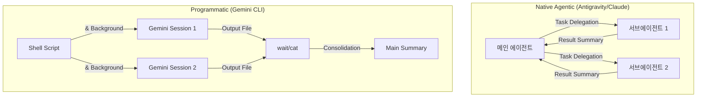

# 07. Subagent: Claude 수준의 자율 협업 구현

이 디렉토리는 Antigravity, Gemini CLI 및 기타 AI 코딩 도구들을 사용하여 **Claude 수준의 서브에이전트(Subagent)** 환경을 구축하고 활용하는 방법을 다룹니다.

## 📊 도구별 서브에이전트 지원 현황 시각화

### 1. 기능 비교 매트릭스
각 도구가 제공하는 서브에이전트 기능의 성숙도와 병렬 처리 능력을 한눈에 비교합니다.

| 도구 | 방식 | 병렬성 | 격리 수준 | 시각화(GUI) | 성숙도 |
| :--- | :--- | :---: | :---: | :---: | :---: |
| **Antigravity** | Agent Manager | 무제한 | 높음 | ✅ | 상 |
| **Claude Code** | Task() API | 7개 | 높음 | ❌ | 상 |
| **Cursor** | Background VM | 8개 | 최고 | ✅ | 상 |
| **VS Code Copilot** | GitHub Issues | 제한적 | 보통 | ✅ | 중 |
| **Gemini CLI** | Shell/Hooks | 매뉴얼 | 보통 | ❌ | 중 |
| **Codex CLI** | 실험적 플래그 | 2~3개 | 낮음 | ❌ | 하 |

### 2. 아키텍처 비교 (Mermaid)

---

## 📘 관련 가이드 문서
| 문서명 | 주요 내용 |
| :--- | :--- |
| [antigravity-subagent-guide.md](./antigravity-subagent-guide.md) | Mission Control 기반의 GUI 멀티에이전트 활용법 |
| [claude-code-subagent-guide.md](./claude-code-subagent-guide.md) | Claude의 Task() API 및 모델 라우팅 전략 |
| [gemini-cli-subagent-guide.md](./gemini-cli-subagent-guide.md) | 셸 스크립팅과 tmux를 이용한 대안 구현 |
| [codex-subagent-guide.md](./codex-subagent-guide.md) | 실험적 멀티에이전트 기능 및 클라우드 처리 |
| [cursor-subagent-guide.md](./cursor-subagent-guide.md) | 격리된 VM 및 Git Worktree 기반의 충돌 방지 |
| [vscode-subagent-guide.md](./vscode-subagent-guide.md) | GitHub 이슈 기반의 Coding Agent 워크플로우 |

## 💡 구현 전략 요약
1.  **GUI 선호**: Antigravity의 **Agent Manager**를 사용하여 시각적으로 스폰/관리하세요.
2.  **자동화 선호**: Gemini CLI의 **셸 병렬화(`&`, `wait`)** 혹은 **Hooks 시스템**을 통해 파이프라인을 구축하세요.
3.  **대규모 작업**: Claude Code의 **Task()** 기능을 사용하여 메인 컨텍스트를 보호하며 작업하세요.
